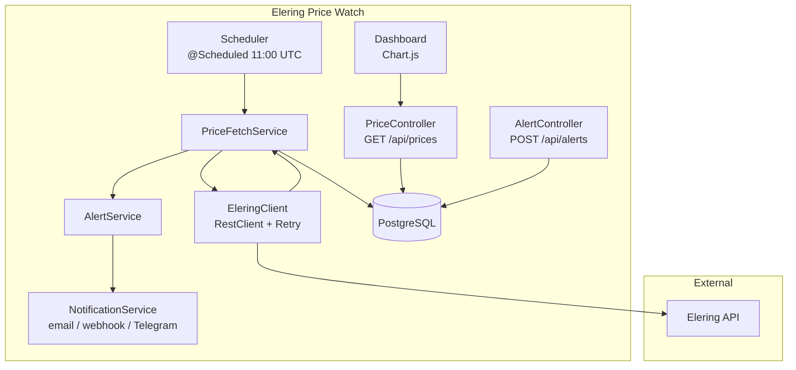

# ⚡ Elering Price Watch

[](https://openjdk.org/projects/jdk/21/)
[](https://spring.io/projects/spring-boot)
[](https://www.postgresql.org/)
[](https://www.docker.com/)
[](.github/workflows/ci.yml)

A Spring Boot 3 service that tracks **Estonian Nord Pool day-ahead electricity prices** via the public [Elering API](https://dashboard.elering.ee/api) and alerts users when prices cross user-defined thresholds.

---

## Architecture



---

## Quick Start

```bash
git clone https://github.com/ahmedshalaby29/elering-price-watch.git
cd elering-price-watch
docker-compose up --build
```

Then seed the database with today's prices:
```bash
curl -X POST "http://localhost:8080/api/admin/trigger-fetch?date=$(date +%Y-%m-%d)"
```

| URL | Description |
|---|---|
| `http://localhost:8080/` | Chart.js price dashboard |
| `http://localhost:8080/swagger-ui.html` | Swagger API docs |
| `http://localhost:8080/actuator/health` | Health check |

---

## Key Features

| Feature | Details |
|---|---|
| **Scheduled fetch** | Daily at 11:00 UTC for EE/FI/LV/LT zones |
| **Today / Tomorrow prices** | 24 hourly prices per zone |
| **Cheapest hours** | Contiguous O(n) sliding window + non-contiguous O(n log n) sort |
| **Price statistics** | Min / max / avg over any date range |
| **Multi-zone compare** | Side-by-side for all 4 Baltic zones |
| **Alerts** | Email, Webhook (Slack/n8n/Zapier), Telegram — 24h cooldown |
| **VAT-inclusive price** | EUR/kWh = raw EUR/MWh ÷ 1000 × 1.22 |
| **RFC 7807 errors** | All errors return `application/problem+json` |

---

## API Examples

```bash
# Today's prices (Estonia)
curl "http://localhost:8080/api/prices/today?zone=EE"

# Cheapest 3 non-contiguous hours
curl "http://localhost:8080/api/prices/cheapest?zone=EE&hours=3&contiguous=false"

# Cheapest 4-hour contiguous block
curl "http://localhost:8080/api/prices/cheapest?zone=EE&hours=4&contiguous=true"

# Statistics for a date range
curl "http://localhost:8080/api/prices/stats?zone=EE&from=2025-01-01T00:00:00Z&to=2025-02-01T00:00:00Z"

# Compare all Baltic zones
curl "http://localhost:8080/api/prices/compare?zones=EE,FI,LV,LT"

# Register a Telegram alert (notify when price drops below 30 EUR/MWh)
curl -X POST http://localhost:8080/api/alerts \
  -H "Content-Type: application/json" \
  -d '{"zone":"EE","thresholdEurMwh":30,"direction":"BELOW","channel":"TELEGRAM","telegramChatId":"-100123456"}'

# Manually trigger a fetch
curl -X POST "http://localhost:8080/api/admin/trigger-fetch?date=2025-01-16"
```

---

## Configuration

Key environment variables (all have safe defaults for local development):

| Variable | Default | Description |
|---|---|---|
| `SPRING_DATASOURCE_URL` | `jdbc:postgresql://localhost:5432/pricewatch` | PostgreSQL URL |
| `SPRING_DATASOURCE_PASSWORD` | `pricewatch` | DB password |
| `PRICE_FETCH_CRON` | `0 0 11 * * *` | Fetch schedule (UTC) |
| `SCHEDULING_ZONES` | `EE,FI,LV,LT` | Zones to fetch |
| `NOTIFICATIONS_EMAIL_ENABLED` | `false` | Enable email alerts |
| `NOTIFICATIONS_TELEGRAM_ENABLED` | `false` | Enable Telegram alerts |
| `TELEGRAM_BOT_TOKEN` | _(empty)_ | Telegram Bot token |
| `MAIL_USERNAME` / `MAIL_PASSWORD` | _(empty)_ | SMTP credentials |

---

## Testing

```bash
# Unit tests (no Docker needed)
mvn test

# All tests including integration (requires Docker for Testcontainers)
mvn verify
```

| Test | Type | Covers |
|---|---|---|
| `PriceServiceTest` | Unit | Sliding-window algorithm, edge cases |
| `AlertServiceTest` | Unit | Threshold logic, 24h cooldown |
| `PriceControllerIT` | Integration | Full HTTP round-trip, error format |
| `PriceFetchSchedulerIT` | Integration | WireMock-stubbed API, upsert idempotency |
| `HourlyPriceRepositoryIT` | Integration | JPA queries, stats projection |

---

## Tech Stack

Java 21 · Spring Boot 3.3 · PostgreSQL 16 · Flyway · MapStruct · Lombok · springdoc-openapi · Testcontainers · WireMock · Docker · GitHub Actions

---

## License

MIT
